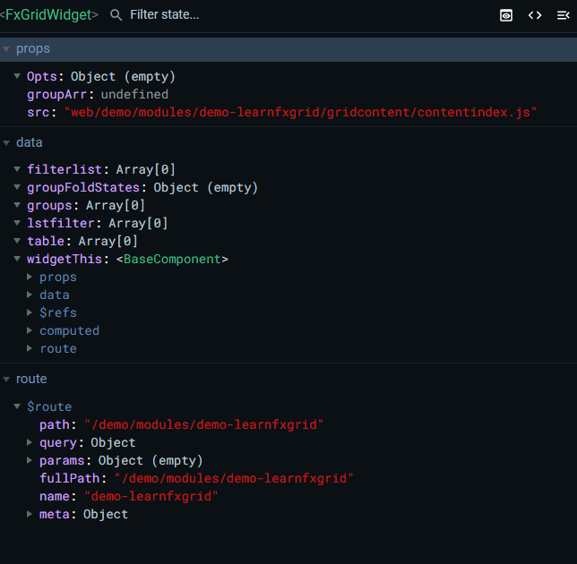
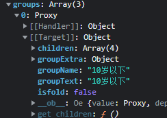

前端文件无需build

webide是的调试无需调试环境

- `web/[demo]/modules/[xxx]`: **一个文件夹就是一个框架动态页面**
- `web/[demo]/modules/[xxx]/assets `: 推荐用于存放框架动态页面或动态模块的静态资源等。(可选扩展配置)
- `web/[demo]/modules/[xxx]/widgets `: 用于`存放框架动态页面或动态模块独有`的公用插件/组件相关模板、配置、资源等。(可选扩展配置)
- `web/[demo]/modules/[xxx]/main.html `: 原 .vue 文件中的 `<template>`, `<style>` 标签。`<style> 标签的 scoped 失效`, 所有编写的样式类名都引入到全局，所以在样式起类名的时候要格外注意是否重命名以及时候规范，避免造成样式污染等问题。 必选
- `web/[demo]/modules/[xxx]/main.js `: 原 .vue 文件中的 `<script>` 标签。即使没有使用到也`必须在 main.js 里 retuen 一个空对象`。新增框架独有的生命周期钩子 [skylandEx.hooks](http://192.168.0.59:7100/#/guide/dycomponents/lifecycleHooks)。 必选
- `web/[demo]/modules/[xxx]/main.json `: 框架动态页面配置文件, 如: api接口, 分辨率等等 (可选扩展配置)

# 组件

## fx-widget

用于引入`组件`, `模块公用组件`, `全局公用组件`的前端组件, 也是接入 `WebIDE` 的入口

fx-widget props:


src: 用于引入组件，路径必须从web/...开始

| 属性 | 说明                                  | 类型   | 默认值 |
| ---- | ------------------------------------- | ------ | :----- |
| src  | 用于引入组件，路径名必须从web/...开始 | String | -      |

fx-widget events:

| 事件名 | 说明                         | 返回值 |
| ------ | ---------------------------- | ------ |
| loaded | 组件加载完成后，执行指定函数 |        |

**继承自 fx-widget 的拓展组件：**

- [fx-grid-widget](http://192.168.0.59:7100/#/components/fx-grid-widget) - 列表组件
- [fx-filter-button](http://192.168.0.59:7100/#/components/fx-filter-button) - 过滤组件
- [fx-filter-widget](http://192.168.0.59:7100/#/components/fx-filter-widget) - 过滤组件(旧)

## fx-grid-widget



传入参数对象Opts

```javascript
Opts = {
    //将请求到的数据（api/本地读取）放到dataList中，组件会对其进行监听，依据dataList的值进行一些操作
	dataList:[],
    //数据的分组规则
    groupRule: {
        // 分组函数，dataList变动时，调用此函数
        groupFn: function (row) {},
        //组之间排序规则自定义
        compareFn: function () {},
        //分组字段
        field: 'department'
    },
    //组内排序规则
    orderRule: {},
    //过滤函数列表
    filterRuleFnArr: [] //[Fn1, Fn2, ...]
    filterFnEx
}
```

### dataList与table

dataList类型为数组，用于放置api请求的数据，格式类似`[ {},{},{}... ]`，一个列表内存储了若干条数据对象；

fx-grid-widget组件会自动读取传入的dataList，依据dataList中的数据生成一个table数组，table数组存放在<span style="color:red;">fx-grid-widget组件自身上：`gridThis.table`</span>；

通过监听dataList的变动，实时地将dataList中的数据包装成一个具有统一数据结构的table列表，table的数据格式如`[ {RowData:{}, RowIndex:0} ]`，RowData对象存储了dataList中的每个数据对象，RowIndex用来标明数据索引；

```javascript
// table的数据格式实例
{ "RowData": { "EnName": "admin", "id": 189884, "action": "/api/core/logout", "logdate": "2022-04-14 11:16:11", "ipAddress": "192.168.101.1", "logresult": "退出系统" }, "RowIndex": 0 }
```


### dataList与groups

fx-grid-widget组件依据传入的groupFn函数来对dataList中数据进行分组，函数接收dataList中每个数据对象，在内部判断数据对象中的值，返回相应分组名称；

groups类型为数组，数组内每个元素是一个proxy对象，每个proxy对象都是由dataList数据进行包装而来；



```javascript
// groups数据格式实例
groups: [Proxy, Proxy, ...]
Proxy: [[Target]]: {
    children: [{RowData:{}, RowIndex:0}, {}, {}, ...], //data
    groupExtra: {},
    groupName: "",
    groupText: "",//分组标题
    isfold: false
    
}
```


table与groups必须二选一，当传入的配置项groupRule.groupFn为null，或者整个分组规则定义为null时，table会自动生成；

```javascript
// 指定数据以table展示，方法1
groupRule: null
// 指定数据以table展示，方法2
groupRule: {}
// 指定数据以table展示，方法3
groupRule: {
    groupFn:null
}
```

## SetFilter方法

```javascript
this.gridThis.SetFilter("selectPersonType",val && val != "*" ? ((row) => row.type == val) : null);
```

`state.gridThis.SetFilter(key, fn, mode);`

Key：排序类型

fn：判断函数，依据需求返回布尔值的函数

mode：过滤模式

fx-grid-widget接收一个自身的gridThis数据，在vue中利用计算属性去计算table展示到页面？？

为什么不this.table????还要this.gridThis.table？？？

fx-grid-widget组件通过ref拿到，被存储在了vuex中；但在fx-grid-widget内部却要获取gridThis；说明fx-grid-widget内部还有一个vue component实例；

这个实例是fx-widget组件。


传入loaded回调执行函数init

```javascript
init() {
	// 在此函数中将fx-grid-widget组件对象挂载到vuex中
    
    //异步获取一些数据，存放在fx-grid-widget组件对象Opts.dataList中
    
}
```

init方法接收了一个参数，该参数为一个组件对象