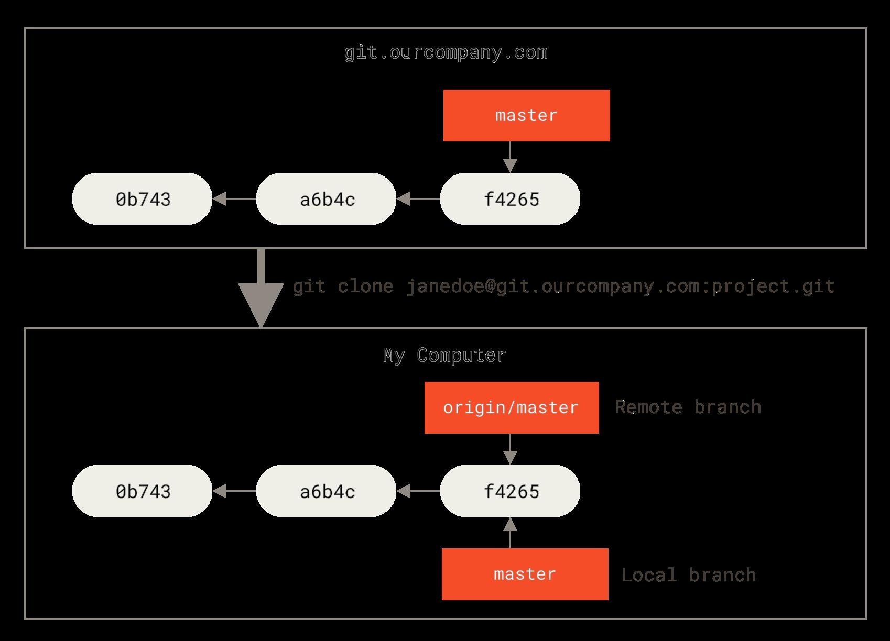

# git使用笔记


git中的基本概念

暂存区

远程仓库

分支

合并分支

头指针


## 命令

git status

git status --short 


### git clone

`git clone https://github.com/Anqing-None/MyNotes.git`

从远程仓库复制代码到本地。

本地自动具有origin/main分支，同时也在本地创建了main指针。

```bash
D:\myDocument\MyNotes>git branch -a
* main
  remotes/origin/HEAD -> origin/main
  remotes/origin/main
```

使用代理cloneGIthub代码：
git clone https://github.com/Anqing-None/MyNotes.git --config 'https.proxy=sock5://127.0.0.1:1080'




### git fetch

git fetch会向远程分支获取最新的commit提交，并将origin/main指针指向最新的commit。


<svg xmlns="http://www.w3.org/2000/svg" xmlns:xlink="http://www.w3.org/1999/xlink" version="1.1" width="421px" viewBox="-0.5 -0.5 421 171" content="&lt;mxfile host=&quot;Electron&quot; modified=&quot;2022-04-16T09:39:08.676Z&quot; agent=&quot;5.0 (Windows NT 10.0; Win64; x64) AppleWebKit/537.36 (KHTML, like Gecko) draw.io/16.5.1 Chrome/96.0.4664.110 Electron/16.0.7 Safari/537.36&quot; etag=&quot;9BmQwt43WKvRUfPc4cKT&quot; version=&quot;16.5.1&quot; type=&quot;device&quot;&gt;&lt;diagram id=&quot;anAnoqZglmBlmmNPIVT8&quot; name=&quot;第 1 页&quot;&gt;3ZhNc9owEIZ/DUdmkI2NOTYE2kMy7QzTaa+KtdhKZK9HFl/99ZWxjFFEGDolMeSE9UpC3nef9Xrc8yfZ5qukRfqIDETPG7BNz7/veR7xyVD/VMq2VsKI1EIiOTOLWmHO/4ARB0ZdcgaltVAhCsULW4wxzyFWlkalxLW9bIHCPrWgCTjCPKbCVX9xplKjknDcTnwDnqTm6Mgb1RMZbRabSMqUMlwfSP60508koqqvss0ERGVe40u9b/bG7P7GJOTqnA3DJzLL1c/fj8U0+479l4f+j7Lv1/+yomJpAjY3q7aNA8C0IWaIUqWYYE7FtFXvJC5zBtUxAz1q1zwgFlokWnwGpbYmu3SpUEupyoSZrc+sDnozNiOVuJQxnAioYYTKBNSJdd4+AxpdwAyU3Op9EgRVfGXfBzUMJft1rc36wjj9D64Tx3Xq2G6buk65gnlBd7GvdakdM3AFUsHmtIVuyGaD33BqCtULzHjdYt9I6QHw/uCdTAo/G5remWgGXaLpOa4/dY7m8NrQbJrT52EzOJPNcZdsBo7rcedsBtfGZnTjJI5u4Sk5ckjMKM+vDsZ9T+8KxrHjE+vcpHAUXFfFkltvHuTcl+5Ouwdx37pR8qQq29lVVG8Y2tVLIhfM6EPBDLoAk9Ey3e2/NKXDW+gszV2+D6VHvP2/hjOwn6XdIxs59iVcaWEBKk4d83TkynaoVBJfYIICpVZyzCumF1yIVxIVPMn1MNZOgdbvKh95TMUXM5FxxnYFcSwldtIunpXoVYcL3ayEl8mKHrZfsHZzB98B/elf&lt;/diagram&gt;&lt;/mxfile&gt;" onclick="(function(svg){var src=window.event.target||window.event.srcElement;while (src!=null&amp;&amp;src.nodeName.toLowerCase()!='a'){src=src.parentNode;}if(src==null){if(svg.wnd!=null&amp;&amp;!svg.wnd.closed){svg.wnd.focus();}else{var r=function(evt){if(evt.data=='ready'&amp;&amp;evt.source==svg.wnd){svg.wnd.postMessage(decodeURIComponent(svg.getAttribute('content')),'*');window.removeEventListener('message',r);}};window.addEventListener('message',r);svg.wnd=window.open('https://viewer.diagrams.net/?client=1&amp;page=0&amp;edit=_blank');}}})(this);" style="cursor:pointer;max-width:100%;max-height:171px;"><defs/><g><path d="M 50 85 L 93.63 85" fill="none" stroke="rgb(0, 0, 0)" stroke-miterlimit="10" pointer-events="stroke"/><path d="M 98.88 85 L 91.88 88.5 L 93.63 85 L 91.88 81.5 Z" fill="rgb(0, 0, 0)" stroke="rgb(0, 0, 0)" stroke-miterlimit="10" pointer-events="all"/><rect x="0" y="70" width="50" height="30" fill="rgb(255, 255, 255)" stroke="rgb(0, 0, 0)" pointer-events="all"/><g transform="translate(-0.5 -0.5)"><switch><foreignObject pointer-events="none" width="100%" height="100%" requiredFeatures="http://www.w3.org/TR/SVG11/feature#Extensibility" style="overflow: visible; text-align: left;"><div xmlns="http://www.w3.org/1999/xhtml" style="display: flex; align-items: unsafe center; justify-content: unsafe center; width: 48px; height: 1px; padding-top: 85px; margin-left: 1px;"><div data-drawio-colors="color: rgb(0, 0, 0); " style="box-sizing: border-box; font-size: 0px; text-align: center;"><div style="display: inline-block; font-size: 12px; font-family: Helvetica; color: rgb(0, 0, 0); line-height: 1.2; pointer-events: all; white-space: normal; overflow-wrap: normal;">a</div></div></div></foreignObject><text x="25" y="89" fill="rgb(0, 0, 0)" font-family="Helvetica" font-size="12px" text-anchor="middle">a</text></switch></g><path d="M 150 85 L 193.63 85" fill="none" stroke="rgb(0, 0, 0)" stroke-miterlimit="10" pointer-events="stroke"/><path d="M 198.88 85 L 191.88 88.5 L 193.63 85 L 191.88 81.5 Z" fill="rgb(0, 0, 0)" stroke="rgb(0, 0, 0)" stroke-miterlimit="10" pointer-events="all"/><rect x="100" y="70" width="50" height="30" fill="rgb(255, 255, 255)" stroke="rgb(0, 0, 0)" pointer-events="all"/><g transform="translate(-0.5 -0.5)"><switch><foreignObject pointer-events="none" width="100%" height="100%" requiredFeatures="http://www.w3.org/TR/SVG11/feature#Extensibility" style="overflow: visible; text-align: left;"><div xmlns="http://www.w3.org/1999/xhtml" style="display: flex; align-items: unsafe center; justify-content: unsafe center; width: 48px; height: 1px; padding-top: 85px; margin-left: 101px;"><div data-drawio-colors="color: rgb(0, 0, 0); " style="box-sizing: border-box; font-size: 0px; text-align: center;"><div style="display: inline-block; font-size: 12px; font-family: Helvetica; color: rgb(0, 0, 0); line-height: 1.2; pointer-events: all; white-space: normal; overflow-wrap: normal;">b</div></div></div></foreignObject><text x="125" y="89" fill="rgb(0, 0, 0)" font-family="Helvetica" font-size="12px" text-anchor="middle">b</text></switch></g><path d="M 250 85 L 348.63 85" fill="none" stroke="rgb(0, 0, 0)" stroke-miterlimit="10" pointer-events="stroke"/><path d="M 353.88 85 L 346.88 88.5 L 348.63 85 L 346.88 81.5 Z" fill="rgb(0, 0, 0)" stroke="rgb(0, 0, 0)" stroke-miterlimit="10" pointer-events="all"/><rect x="200" y="70" width="50" height="30" fill="rgb(255, 255, 255)" stroke="rgb(0, 0, 0)" pointer-events="all"/><g transform="translate(-0.5 -0.5)"><switch><foreignObject pointer-events="none" width="100%" height="100%" requiredFeatures="http://www.w3.org/TR/SVG11/feature#Extensibility" style="overflow: visible; text-align: left;"><div xmlns="http://www.w3.org/1999/xhtml" style="display: flex; align-items: unsafe center; justify-content: unsafe center; width: 48px; height: 1px; padding-top: 85px; margin-left: 201px;"><div data-drawio-colors="color: rgb(0, 0, 0); " style="box-sizing: border-box; font-size: 0px; text-align: center;"><div style="display: inline-block; font-size: 12px; font-family: Helvetica; color: rgb(0, 0, 0); line-height: 1.2; pointer-events: all; white-space: normal; overflow-wrap: normal;">c</div></div></div></foreignObject><text x="225" y="89" fill="rgb(0, 0, 0)" font-family="Helvetica" font-size="12px" text-anchor="middle">c</text></switch></g><path d="M 225 140 L 225 106.37" fill="none" stroke="rgb(0, 0, 0)" stroke-miterlimit="10" pointer-events="stroke"/><path d="M 225 101.12 L 228.5 108.12 L 225 106.37 L 221.5 108.12 Z" fill="rgb(0, 0, 0)" stroke="rgb(0, 0, 0)" stroke-miterlimit="10" pointer-events="all"/><rect x="200" y="140" width="50" height="30" fill="rgb(255, 255, 255)" stroke="rgb(0, 0, 0)" pointer-events="all"/><g transform="translate(-0.5 -0.5)"><switch><foreignObject pointer-events="none" width="100%" height="100%" requiredFeatures="http://www.w3.org/TR/SVG11/feature#Extensibility" style="overflow: visible; text-align: left;"><div xmlns="http://www.w3.org/1999/xhtml" style="display: flex; align-items: unsafe center; justify-content: unsafe center; width: 48px; height: 1px; padding-top: 155px; margin-left: 201px;"><div data-drawio-colors="color: rgb(0, 0, 0); " style="box-sizing: border-box; font-size: 0px; text-align: center;"><div style="display: inline-block; font-size: 12px; font-family: Helvetica; color: rgb(0, 0, 0); line-height: 1.2; pointer-events: all; white-space: normal; overflow-wrap: normal;">main</div></div></div></foreignObject><text x="225" y="159" fill="rgb(0, 0, 0)" font-family="Helvetica" font-size="12px" text-anchor="middle">main</text></switch></g><rect x="355" y="70" width="50" height="30" fill="rgb(255, 255, 255)" stroke="rgb(0, 0, 0)" pointer-events="all"/><g transform="translate(-0.5 -0.5)"><switch><foreignObject pointer-events="none" width="100%" height="100%" requiredFeatures="http://www.w3.org/TR/SVG11/feature#Extensibility" style="overflow: visible; text-align: left;"><div xmlns="http://www.w3.org/1999/xhtml" style="display: flex; align-items: unsafe center; justify-content: unsafe center; width: 48px; height: 1px; padding-top: 85px; margin-left: 356px;"><div data-drawio-colors="color: rgb(0, 0, 0); " style="box-sizing: border-box; font-size: 0px; text-align: center;"><div style="display: inline-block; font-size: 12px; font-family: Helvetica; color: rgb(0, 0, 0); line-height: 1.2; pointer-events: all; white-space: normal; overflow-wrap: normal;">d</div></div></div></foreignObject><text x="380" y="89" fill="rgb(0, 0, 0)" font-family="Helvetica" font-size="12px" text-anchor="middle">d</text></switch></g><path d="M 380 30 L 380 63.63" fill="none" stroke="rgb(0, 0, 0)" stroke-miterlimit="10" pointer-events="stroke"/><path d="M 380 68.88 L 376.5 61.88 L 380 63.63 L 383.5 61.88 Z" fill="rgb(0, 0, 0)" stroke="rgb(0, 0, 0)" stroke-miterlimit="10" pointer-events="all"/><rect x="340" y="0" width="80" height="30" fill="rgb(255, 255, 255)" stroke="rgb(0, 0, 0)" pointer-events="all"/><g transform="translate(-0.5 -0.5)"><switch><foreignObject pointer-events="none" width="100%" height="100%" requiredFeatures="http://www.w3.org/TR/SVG11/feature#Extensibility" style="overflow: visible; text-align: left;"><div xmlns="http://www.w3.org/1999/xhtml" style="display: flex; align-items: unsafe center; justify-content: unsafe center; width: 78px; height: 1px; padding-top: 15px; margin-left: 341px;"><div data-drawio-colors="color: rgb(0, 0, 0); " style="box-sizing: border-box; font-size: 0px; text-align: center;"><div style="display: inline-block; font-size: 12px; font-family: Helvetica; color: rgb(0, 0, 0); line-height: 1.2; pointer-events: all; white-space: normal; overflow-wrap: normal;">origin/main</div></div></div></foreignObject><text x="380" y="19" fill="rgb(0, 0, 0)" font-family="Helvetica" font-size="12px" text-anchor="middle">origin/main</text></switch></g><path d="M 225 30 L 225 63.63" fill="none" stroke="rgb(0, 0, 0)" stroke-miterlimit="10" stroke-dasharray="3 3" pointer-events="stroke"/><path d="M 225 68.88 L 221.5 61.88 L 225 63.63 L 228.5 61.88 Z" fill="rgb(0, 0, 0)" stroke="rgb(0, 0, 0)" stroke-miterlimit="10" pointer-events="all"/><rect x="185" y="0" width="80" height="30" fill="rgb(255, 255, 255)" stroke="rgb(0, 0, 0)" stroke-dasharray="3 3" pointer-events="all"/><g transform="translate(-0.5 -0.5)"><switch><foreignObject pointer-events="none" width="100%" height="100%" requiredFeatures="http://www.w3.org/TR/SVG11/feature#Extensibility" style="overflow: visible; text-align: left;"><div xmlns="http://www.w3.org/1999/xhtml" style="display: flex; align-items: unsafe center; justify-content: unsafe center; width: 78px; height: 1px; padding-top: 15px; margin-left: 186px;"><div data-drawio-colors="color: rgb(0, 0, 0); " style="box-sizing: border-box; font-size: 0px; text-align: center;"><div style="display: inline-block; font-size: 12px; font-family: Helvetica; color: rgb(0, 0, 0); line-height: 1.2; pointer-events: all; white-space: normal; overflow-wrap: normal;">origin/main</div></div></div></foreignObject><text x="225" y="19" fill="rgb(0, 0, 0)" font-family="Helvetica" font-size="12px" text-anchor="middle">origin/main</text></switch></g><rect x="265" y="80" width="60" height="30" fill="none" stroke="none" pointer-events="all"/><g transform="translate(-0.5 -0.5)"><switch><foreignObject pointer-events="none" width="100%" height="100%" requiredFeatures="http://www.w3.org/TR/SVG11/feature#Extensibility" style="overflow: visible; text-align: left;"><div xmlns="http://www.w3.org/1999/xhtml" style="display: flex; align-items: unsafe center; justify-content: unsafe center; width: 58px; height: 1px; padding-top: 95px; margin-left: 266px;"><div data-drawio-colors="color: rgb(0, 0, 0); " style="box-sizing: border-box; font-size: 0px; text-align: center;"><div style="display: inline-block; font-size: 12px; font-family: Helvetica; color: rgb(0, 0, 0); line-height: 1.2; pointer-events: all; white-space: normal; overflow-wrap: normal;">git fetch</div></div></div></foreignObject><text x="295" y="99" fill="rgb(0, 0, 0)" font-family="Helvetica" font-size="12px" text-anchor="middle">git fetch</text></switch></g></g><switch><g requiredFeatures="http://www.w3.org/TR/SVG11/feature#Extensibility"/><a transform="translate(0,-5)" xlink:href="https://www.diagrams.net/doc/faq/svg-export-text-problems" target="_blank"><text text-anchor="middle" font-size="10px" x="50%" y="100%">Text is not SVG - cannot display</text></a></switch></svg>


### git rm 

将staged文件状态移除，使其状态为unstage，不追踪该文件变更记录


```
git rm --cached <file>...
```

git resest


### git branch

创建分支：`  git branch <branch name>`

列出分支：`git branch`

切换分支：` git checkout <branch name> `

创建并切换到新建分支：`  git checkout -b <branch name>`

删除分支：`git branch -D <branch name>`

重命名分支：`git branch -m <newBranchName> <oldBranchName>`

合并两个分支：`git merge <branch name>`


### git stash

将未追踪的变动（没有使用git add命令添加到stage库的文件）理解为草稿，

保存当前草稿：git stash

查看保存的草稿：git stash list

继续编写上次保存的草稿：git stash pop


### git remote

查看远程仓库地址

git remote -v/--verbose

提交到本地仓库

git commit -m "description"


### git log 

查看commit历史，顺序按照日期由近至远

参数（option）

-p, --patch :显示每次提交所引入的差异


示例：

`git log --graph --pretty=oneline`

```bash
* da39cbfe6231ce43fc7c15fe7f5460efbc87beac (HEAD -> main) adds sequelize notes
* e82ca7f917e80a043879ec5057f7eb1b3ecd4edb add skyland notes
* 0794904fc5e9f9abf7c76f45dd6fb9a3857251c8 add Vue basic Note
* 133ace292582dd347bca498544835502664ab789 add = i
* af53718ee9a16867b61166f83dab8b324a4bcba4 Create imgTag.md
```


### git push


### git pull

### git config

配置用户基本信息

```bash
git config --global user.name <username>
git config --global user.email <mail>
```

查看git目前使用的配置，及配置文件所在位置

`git config --list --show-origin`


### 多人协作

