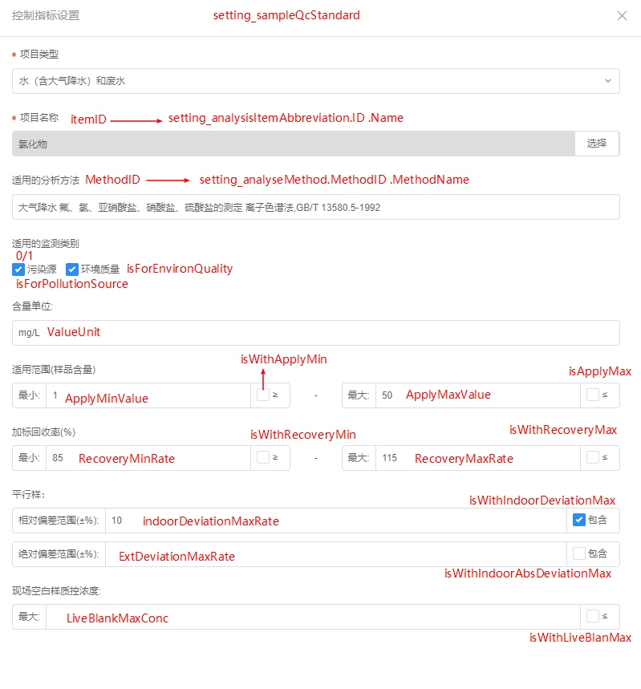

# setting_sampleqcstandard
样品质控指标设置表

## ID
主键
## IsRemoved
0/1,是否被移除
## ItemID
检测因子ID
## ValueUnit
单位
## ApplyMinValue
质控标准适用的样品含量范围，不同范围会对应不同的加标回收率/相对偏差合格范围
## IsWithApplyMin
是否包含样品含量最小值，即是否包含≥中的＝号
## ApplyMaxValue
## IsWithApplyMax
## RecoveryMinRate
回收率
## IsWithRecoveryMin
## RecoveryMaxRate
## IsWithRecoveryMax
## IndoorDeviationMaxRate
## IsWithIndoorDeviationMax
## ExtDeviationMaxRate
## IsWithExtDeviationMax
## MethodID
对应方法标准ID
## IndoorAbsDeviationMaxRate

## IsWithIndoorAbsDeviationMax
## IsForPollutionSource
## IsForEnvironQuality
## IsWithLiveBlanMax
## LiveBlankMaxConc
