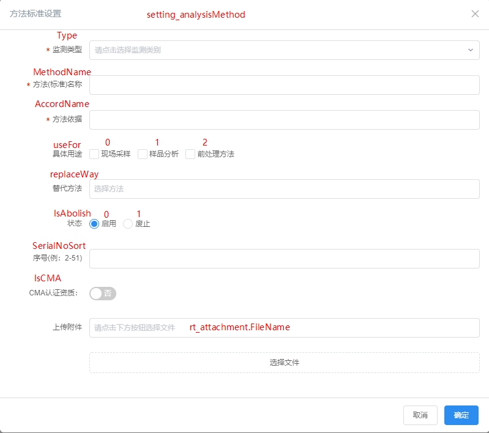

# setting_analysemethod

分析方法设置表，记录所有分析标准。

方法废止

新增一个方法去替代老方法的逻辑问题

1.在新增界面选择老方法

老方法的IsAbolish字段会更新为1

新增的方法的ReplaceWay会记录老方法的MethodID

此时如果删除新方法，新方法的IsAbolish未将其状态更新为0

## methodID

分析标准ID，主键。一个检测标准对应一个ID。

## MethodName

标准名称，示例值：“水质 汞、砷、硒、铋和锑的测定 原子荧光法”

## AccordName

国家标准的编号，示例值：HJ 694-2014。HJ 694-2014一一对应标准名称。

## Type

分析项目类型，大类，示例值：水（含大气降水）和废水

此字段与Setting_InspectType表中的InspectBasicType对应，见[Setting_InspectType](Setting_InspectType检测项目类别分类.md/#InspectBasicType)

## UseFor

示例值：0;1;2;，表示可用于现场采样、样品分析、前处理方法

方法的具体用途，0：现场采样1：样品分析2：前处理方法

## IsRemoved

是否被移除，从前端界面删除此方法会将该字段标记为1

## _PickRecord

## _SeriaNo

## SeriaNoSort

## IsAbolish

方法是否被废除。如果方法被替代，此方法则应标记为废除。

## replaceWay

方法更新情况，如果方法被替代，此字段会记录新的方法ID（methodID），用户可以查询到最新方法。

替代的是已有的方法，也就是说，方法必须先存在。

## replaceTime

被替换时的时间

## replacedBy

此方法被“谁”替代，记录“谁”的MethodID

## isCMA

## OrgID

