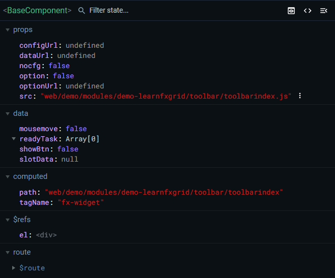

前端文件无需build

webide是的调试无需调试环境

- `web/[demo]/modules/[xxx]`: **一个文件夹就是一个框架动态页面**
- `web/[demo]/modules/[xxx]/assets `: 推荐用于存放框架动态页面或动态模块的静态资源等。(可选扩展配置)
- `web/[demo]/modules/[xxx]/widgets `: 用于`存放框架动态页面或动态模块独有`的公用插件/组件相关模板、配置、资源等。(可选扩展配置)
- `web/[demo]/modules/[xxx]/main.html `: 原 .vue 文件中的 `<template>`, `<style>` 标签。`<style> 标签的 scoped 失效`, 所有编写的样式类名都引入到全局，所以在样式起类名的时候要格外注意是否重命名以及时候规范，避免造成样式污染等问题。 必选
- `web/[demo]/modules/[xxx]/main.js `: 原 .vue 文件中的 `<script>` 标签。即使没有使用到也`必须在 main.js 里 retuen 一个空对象`。新增框架独有的生命周期钩子 [skylandEx.hooks](http://192.168.0.59:7100/#/guide/dycomponents/lifecycleHooks)。 必选
- `web/[demo]/modules/[xxx]/main.json `: 框架动态页面配置文件, 如: api接口, 分辨率等等 (可选扩展配置)

# 组件

## fx-widget

用于引入`组件`, `模块公用组件`, `全局公用组件`的前端组件, 也是接入 `WebIDE` 的入口

fx-widget props:



### props：

src: 用于引入组件，路径必须从web/...开始

| 属性 | 说明                                  | 类型   | 默认值 |
| ---- | ------------------------------------- | ------ | :----- |
| src  | 用于引入组件，路径名必须从web/...开始 | String | -      |

### events：

fx-widget events:

| 事件名 | 说明                         | 返回值 |
| ------ | ---------------------------- | ------ |
| loaded | 组件加载完成后，执行指定函数 |        |

**继承自 fx-widget 的拓展组件：**

- [fx-grid-widget](http://192.168.0.59:7100/#/components/fx-grid-widget) - 列表组件
- [fx-filter-button](http://192.168.0.59:7100/#/components/fx-filter-button) - 过滤组件
- [fx-filter-widget](http://192.168.0.59:7100/#/components/fx-filter-widget) - 过滤组件(旧)

## fx-grid-widget


传入参数对象Opts

```javascript
Opts = {
    //将请求到的数据（api/本地读取）放到dataList中，组件会对其进行监听，依据dataList的值进行一些操作
	dataList:[],
    //数据的分组规则
    groupRule: {
        // 分组函数，dataList变动时，调用此函数
        groupFn: function (row) {},
        //组之间排序规则自定义
        compareFn: function () {},
        //分组字段
        field: 'department'
    },
    //组内排序规则
    orderRule: {},
    //过滤函数列表
    filterRuleFnArr: [] //[Fn1, Fn2, ...]
    filterFnEx
}
```

### dataList与table

dataList类型为数组，用于放置api请求的数据，格式类似`[ {},{},{}... ]`，一个列表内存储了若干条数据对象；

fx-grid-widget组件会自动读取传入的dataList，依据dataList中的数据生成一个table数组，table数组存放在<span style="color:red;">fx-grid-widget组件自身上：`gridThis.table`</span>；

通过监听dataList的变动，实时地将dataList中的数据包装成一个具有统一数据结构的table列表，table的数据格式如`[ {RowData:{}, RowIndex:0} ]`，RowData对象存储了dataList中的每个数据对象，RowIndex用来标明数据索引；

```javascript
// table的数据格式实例
{ "RowData": { "EnName": "admin", "id": 189884, "action": "/api/core/logout", "logdate": "2022-04-14 11:16:11", "ipAddress": "192.168.101.1", "logresult": "退出系统" }, "RowIndex": 0 }
```


### dataList与groups

fx-grid-widget组件依据传入的groupFn函数来对dataList中数据进行分组，函数接收dataList中每个数据对象，在内部判断数据对象中的值，返回相应分组名称；

groups类型为数组，数组内每个元素是一个proxy对象，每个proxy对象都是由dataList数据进行包装而来；


```javascript
// groups数据格式实例
groups: [Proxy, Proxy, ...]
Proxy: [[Target]]: {
    children: [{RowData:{}, RowIndex:0}, {}, {}, ...], //data
    groupExtra: {},
    groupName: "",
    groupText: "",//分组标题
    isfold: false
    
}
```


table与groups必须二选一，当传入的配置项groupRule.groupFn为null，或者整个分组规则定义为null时，table会自动生成；

```javascript
// 指定数据以table展示，方法1
groupRule: null
// 指定数据以table展示，方法2
groupRule: {}
// 指定数据以table展示，方法3
groupRule: {
    groupFn:null
}
```

## SetFilter方法

```javascript
this.gridThis.SetFilter("selectPersonType",val && val != "*" ? ((row) => row.type == val) : null);
```

`state.gridThis.SetFilter(key, fn, mode);`

Key：排序类型

fn：判断函数，依据需求返回布尔值的函数

mode：过滤模式

fx-grid-widget接收一个自身的gridThis数据，在vue中利用计算属性去计算table展示到页面？？

为什么不this.table????还要this.gridThis.table？？？

fx-grid-widget组件通过ref拿到，被存储在了vuex中；但在fx-grid-widget内部却要获取gridThis；说明fx-grid-widget内部还有一个vue component实例；

这个实例是fx-widget组件。


传入loaded回调执行函数init

```javascript
init() {
	// 在此函数中将fx-grid-widget组件对象挂载到vuex中
    
    //异步获取一些数据，存放在fx-grid-widget组件对象Opts.dataList中
    
}
```

init方法接收了一个参数，该参数为一个组件对象

## fx-websheet


## fx-websheet-widget

### props：

| 属性        | 说明                                                         | 类型    | 默认值 |
| ----------- | ------------------------------------------------------------ | ------- | ------ |
| Name*       | 表格名称，必须正确，依据name去寻找模板JSON文件               | String  |        |
| Type*       | 表单分类，例如："pick", 对应需要在目录 `web/config/websheetforms/` 下面创建名称为 ”pick“ 的文件夹 | String  |        |
| DataSource* | 数据源，格式见[DataSource](#DataSource)                      | Object  |        |
| Id          | 表单ID,组件默认会去请求接口 `/api/websheet/[Type]/[Id]` ，因此需要书写对应的 router.js 和 controller。在 controller 内处理表单权限、版本、草稿等实现。 |         |        |
| DataUrl*    | 自定义表单数据接口，默认是 `/api/websheet/[Type]/[Id]`，会优先于上一条Id的指定方式。 | String  |        |
| key         |                                                              |         |        |
| ReadOnly    | 表单是否只读                                                 | Boolean | false  |
| TplObj      | 模板JSON对象,一般不建议使用，推荐是在统一规范的服务端目录下放置表单模板 | Object  |        |
| Opts        | websheet缩放功能条配置项，见[Opts格式](#Opts)                | Object  |        |
| Hooks       | 大量钩子函数                                                 |         |        |
| UserData    | 自定义用户数据，方便随时在各个事件中取出                     | String  |        |
| Namespace   | 命名空间，传入该值就开始监听相同命名空间的表单的 computed 和 alias，实现多表单联动 | String  |        |
| Mode        |                                                              |         |        |
|             |                                                              |         |        |


#### DataSource

DataSource是用来指定表单的默认数据

数据格式：

```
dataSource: {
    "form": {
        "UnitName": "公司名称",
        "InstrumentSize": "",
        "InstrumentNo": 999999966666,
        "MethodAccord": "",
        "ProjectType": "9999",
        "Point": "",
        "Description": "",
        "FlowCalibNo": 2,
        "BeforeCalibrationValue": "1999-02-10 18:10",
        "AfterCalibrationValue": ""
    },
    "table": []
}
```

form

form主要对应的是表格的固定格式区域。每类检测记录表格都有对应模板，模板是表中数据不可变的部分。

table

检测记录表格的数据部分，一般由检测员进行编辑填写检测项目相关信息。


#### Opts

控制表单缩放工具栏

数据格式：

```
{
	leftBar: false,
	topBar: true
}
```

### Hooks

表单会触发一系列生命周期函数保存在web/config/websheetforms/[Type]/[name].js中


```
Load() {
	//表单加载完成触发
}
```


### events：

| 事件名     | 说明                           | 返回值                    |
| ---------- | ------------------------------ | ------------------------- |
| loaded     | 拿到模板文件渲染到页面后触发   | 表单实例对象              |
| oninit     | 单元格初始化后触发             |                           |
| databound  | 单元格公式和事件绑定完毕后触发 |                           |
| datachange | 单元格点击时触发               | 一个包含arg和改变值的对象 |


### methods:

| 方法名                   | 说明                                              | 参数        |
| ------------------------ | ------------------------------------------------- | ----------- |
| GetData(validation=ture) | 获取数据，validation 默认需要校验,传入false不校验 | { Boolean } |
| Deldraft()               | 删除草稿，根据当前服务端传回来的 draftid 删除草稿 |             |
| ExportExcel(filename)    | 导出 Excel 文件， filename 导出后的文件名         | { String }  |

#### GetData

获取表单数据，用户输入数据完毕后，获取到已填写到表单的数据，用于保存草稿或者保存数据。

vue devtool props


### 表单结构模板JSON文件


表单模板json文件一般存储在web/config/websheetforms/[Type]/[name].json

同时会有一个同名的js文件，该文件主要定义表单大量的钩子函数。

Load


#### data

##### entity

指定对应数据区域，见[表单区域示意图](#websheet-form-area-img)

```
取值一般为两类：form与table
"data": [{
	"entity": "$data.form",
	"layout": "form",
	"bind": {...}
},
]
"entity": "$data.form",
```

使用toml语法在A1单元格指定区域范围

```
[[layout]]
layout = "table"
entity = "table"
area = "A16:H20"

指定多个table区域
[[layout]]
layout = "table"
entity = "table1"
area = "A16:H20"

[[layout]]
layout = "table"
entity = "table2"
area = "A16:H20"
```

A1单元格虽然被[[layout]]占用了，指定的区域不需要自己减一，生成的json会自动转换。

因为只有两个区域，所以只需指定table区域即可，其余区域则为form。


##### *bind

绑定单元格/合并单元格的变量

```
    "bind": {
      "E3": {
        "field": "analysisElement",// 对应form区域或table区域DataSource中的数据
        "type": "string",// 变量类型
        "tag": "",// 标记
        "formula": "",// 公式
        "alias": "",// 别名
        "style": {}, //一些样式
        "label": ""  //？？
        "validation": {
        	"regex": "^[^0-9]*$",// 校验正则
        	"tip": "校验失败后的提示"
        },
        "required": true // 是否必填项
        
    }
```

##### type

指定单元格变量类型，string number image treeselect  select datatime degree autocomplete

框架内置了一些type调用的组件存储在`\fx.nodejs.demov1\demo-server\node_modules\@skyland\websheet-server\web\config\websheetcells`

指定type后，双击该单元格，就会调用type组件。

type的实质就是一个继承了HTMLElement类型的自定义HTML元素。依据指定的type值，去相应文件夹下寻找自定义了HTML元素的js文件。

js文件使用AMD模块语法进行引入。在定义时拿到了全局的Vue构造函数，新建了一个元素，将该元素变成vm实例。通过闭包的特性访问此vm实例。vm实例一般用来控制modal对话框，使用户在对话框内进行选择数据，选择数据后在单元格展示。

控制单元格展示值的属性为cellthis.textContent

```JavaScript
define(function () {
  let el = document.createElement("div");

  document.body.appendChild(el);

  let Vue = window.$app.Vue;
  let vm = new Vue({
    el,
    data() {
      return {
        isShow: false,
        cellthis: null, //服务的单元格对象，会在startEdit中赋值
      }
    },
    methods: {
      /**
       * 
       * @param {Object} value 选中的仪器数据 {key：仪器名称，value：[仪器型号]}
       */
      ok(value) {
        // 将数据传给单元格对象,会被value setter函数接收
        this.cellthis.value = JSON.stringify(value);
        // close modal
        this.isShow = false;

      },
      // 用户取消选择
      cancle() {
        // close modal
        this.isShow = false;
      }
    },
    template: 
    `
      <Modal v-model="isShow" :footer-hide="true" :closable="false""> 
        <div>
          <lims-instrumentselect @on-getUnitInfo="ok" @cancle-select="cancle"></lims-instrumentselect>
        </div>
      </Modal>
    `,
  })


  class instruSelect extends HTMLElement {
    constructor () {
      super();
    }

    // 单元格初始化时钩子
    onInit() {
      // debugger;
    }
    //单元格生产到页面
    onMounted(a,b,c) {
      //可以获取到表格数据 tdObj
      // debugger;
      this.tableinfo
    }

    connectedCallback() {
      // debugger;
    }


    get text() {
      return this._value.value[0];
    }

    get value() {
      return this._value;
    }

    // 对单元格的值进行代理
    set value(value) {
      //将值交给setVal函数处理
      this.setVal(value,true);
    }

    /**
     * 
     * @param {String} value json字符串
     * @param {Boolean} flag 标志
     */

    setVal(value,flag) {
      // 尝试将json字符串解析为对象
      try {
        this._value = JSON.parse(value);
      } catch (error) {
        // 如果解析错误，显示空白
        this.textContent = typeof value === `string` ? value : ``;
        return;
      }

      //设置单元格显示的文本，在text的getter中得到文本
      this.textContent = this.text;

      // this.dispatchEvent(new CustomEvent('textchange', {
      //   bubbles: false,
      //   cancelable: false,
      //   detail: [this.text]
      // }))


    }

    //单元格开始编辑，双击单元格进入编辑模式时会触发此函数
    startEdit(){
      
      const _this = this;

      let { options } = this;

      vm.value = this.value;

      vm.cellthis = _this;
      vm.$set(vm, "normalizer", (node) => {
        return {
          id: node[options.nameField],
          label: node[options.textField],
          children: node[options.children],
        }
      })

      // vm.$set(vm, "options", this.treelist)

      //点击单元格时唤醒弹窗
      vm.isShow = true;

      //返回false代表不希望首次输入按键值会有效果,并且这也意味着放弃Tag效果,专注自定义单元格
      return false;
    }
    onTextditorClose() {
      // debugger;
    }
    disconnectedCallback() {
      // debugger;
    }

    //单元格被选中时触发
    onCellSelect() {

    }

    // 单元格在选中时，失去焦点时触发
    onCellUnSelect(){
    }


    onbeforeKeyDown() {
      // debugger;
    }


  }
  return instruSelect;

})
```

###### 单元格事件钩子

一个单元格有一系列钩子

onInit

onMounted

connectedCallback

startEdit

双击单元格时会触发此钩子函数

在此函数中将单元格对象存储到vm对象中

vm对象中可以将用户选择的值传递给单元格对象

单元格自定义元素可以对传递的值进行一定的处理，然后显示到单元格中

onTextditorClose

disconnectedCallback

onCellSelect

onCellUnSelect

onbeforeKeyDown

这些钩子都是定义在自定义元素方法内，也可以新增自定义方法。

钩子函数的this执行的是单元格实例，this中不仅存储了本单元格的数据，还存储了整个表单对象的数据，或者是某一行的数据。

除了对与单个单元格的钩子函数，还有整个表单对象的钩子函数（与表单文件同名的js文件）和fx-websheet-widget组件的[事件](#events)。

###### select

使用select type必须指定options

```
        "C3": {
          "field": "sampleType",
          "type": "select",
          "style": {},
          "options": [{
              "name": 1,
              "text": "土壤"
            },
            {
              "name": 2,
              "text": "沉积物"
            }
          ]
        }
```

text是页面显示的文本，name是传输的数据。

##### formula

简单加减乘除公式可直接使用

```
        {
          "field": "f",
          "type": "string",
          "style": {},
          "formula": "=F6+G6"
        },
```

公式的指定位置必须是field所在行的位置。

函数式公式需要自己定义

web/config/websheetforms/[Type]/inject.js

```
// 使用AMD模块语法定义公式函数

define([], function () {
  return {
    PERCENTAGE (num, total) { 
      if (num == 0 || total == 0){
          return 0;
      }
      return (Math.round(num / total * 10000) / 100.00 + '%');
      }
  }
});
```


##### tag

标签，调用某个自定义HTML标签文件

demo中，此文件存储在`/web/config/websheettags/xxx.js`


##### autocomplete

自动填充

type = "autocomplete" options = "$userdata.SecondCode"


#### cells

cells定义了每个单元格的样式，默认文本

```
// cells looks like
"cells": {
    "A1": {
      "style": {
        "fontFamily": "'宋体', SimSun, Serif",
        "fontSize": "12px",
        "color": "#000000",
        "verticalAlign": "middle",
        "textAlign": "center"
      },
      "text": "无机元素类检验检测分析记录-固体试样(单参数）"
    },
    ...many cells
}
```

#### xlsxRowHeight、xlsxColHeight

记录了表格行高与列宽，单位为px

```
  "xlsxRowHeight": {
    "0": 30,
    "1": 15,
    "2": 15,
    "3": 15
  },
    "xlsxColWidth": {
    "A": 11.28125,
    "B": 8.43,
    "C": 8.43,
    "D": 10.00390625,
	...many columns
  },
```

#### rowHeight、colWidth


#### spans

记录合并的单元格区域

```
  "spans": [
    "A1:I1",
    "B2:H2",
    "B4:J4"
  ],
```


